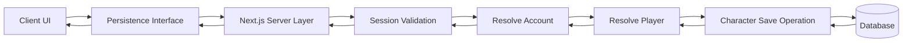
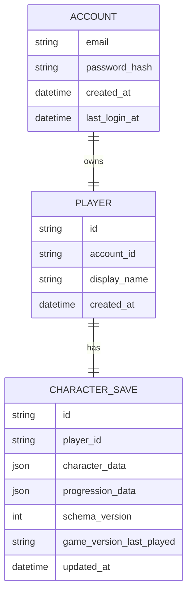

# Auth / Player Persistence

## 1. Overview

This document defines the authentication and player persistence system for Isekai Quest.

The purpose of this system is to establish a reliable, secure, and scalable way to:

- create and authenticate player accounts
- persist player game state across sessions
- support both local development and deployed environments
- provide a consistent interface between the frontend and the persistence layer

This system is designed with a clear separation of concerns between:

- authentication (Account)
- player identity (Player)
- gameplay state (CharacterSave)

For V1, the system is intentionally minimal to support rapid development and testing. However, the structure is designed to support future expansion, including:

- multiple characters per player
- more complex progression tracking
- richer inventory and quest state persistence

All persistence operations are handled through a dedicated interface, ensuring that the application does not depend on a specific storage implementation.

## 2. Goals of the System

The Auth / Player Persistence system is designed to achieve the following goals for V1:

### 2.1 Provide Secure Account Management

- allow players to create accounts using email and password
- ensure passwords are never stored or returned in plain text
- enforce that all authentication is handled through the server layer

### 2.2 Persist Player Game State

- store character data and progression data in a consistent format
- allow players to resume their game state across sessions
- ensure that meaningful gameplay actions are not lost

### 2.3 Establish a Clear Data Model

- separate concerns between Account, Player, and CharacterSave
- maintain a clean relationship structure for future expansion
- support one-to-one relationships for V1 with planned flexibility for one-to-many later

### 2.4 Support Multiple Environments

- enable local development using local storage
- enable deployed environments using a database through the server layer
- ensure the application behaves consistently regardless of environment

### 2.5 Provide a Stable Persistence Interface

- define a single interface for all persistence operations
- prevent the frontend from interacting directly with storage mechanisms
- allow implementations to be swapped without changing application logic
- enable seamless switching between different storage mechanisms (local storage, database, or future providers) based on the current environment

### 2.6 Enable Consistent State Hydration

- ensure that account creation, authentication, and data loading all return the same save payload shape
- allow the frontend to hydrate game state using a single consistent structure

### 2.7 Minimize Complexity for V1

- avoid over-engineering progression tracking
- store only the data required to support current gameplay features
- defer advanced features (multi-character support, complex quest states) to future iterations

## 3. Locked-In Architecture Decisions

The following decisions are finalized for V1 and serve as the foundation for the Auth / Player Persistence system.

These decisions should not be changed during implementation unless a major issue is identified.

---

### 3.1 Use of a Server-Mediated Persistence Layer

All persistence operations must go through the Next.js server layer.

The client will never:

- communicate directly with the database
- have access to database credentials
- determine which records to access using arbitrary identifiers

The server is responsible for:

- handling authentication
- resolving the correct account and player context
- performing all read and write operations

---

### 3.2 Relational Data Model with JSON Fields

The system will use a relational database structure with support for JSON fields.

This allows:

- structured relationships between Account, Player, and CharacterSave
- flexible storage of complex game state objects

The following fields will be stored as JSON:

- `character_data`
- `progression_data`

---

### 3.3 Separation of Concerns Between Core Entities

The system separates responsibilities into three distinct entities:

- **Account** → authentication credentials
- **Player** → game-level identity
- **CharacterSave** → gameplay state

This separation ensures:

- authentication logic is not mixed with gameplay logic
- player identity can evolve independently of save data
- future features (multi-character support) can be added cleanly

---

### 3.4 One-to-One Relationship Model for V1

For V1, the following relationships are enforced:

- one Account → one Player
- one Player → one CharacterSave

This simplifies implementation while maintaining a structure that can later expand to:

- one Player → many CharacterSaves

---

### 3.5 Single Persistence Interface

All persistence actions will be accessed through a single interface.

This interface:

- defines business-level actions (not storage mechanics)
- abstracts away the underlying storage implementation
- allows switching between local storage and database-backed persistence without changing application logic

---

### 3.6 Consistent Save Payload Shape

All read operations must return the same save payload structure.

This applies to:

- `createAccount`
- `authenticateAccount`
- `loadPlayerSaveData`

This ensures:

- the frontend can hydrate state using a single consistent structure
- no conditional logic is needed based on how the data was retrieved

---

### 3.7 JSON-Based Game State Storage

Character and progression data will be stored as JSON objects.

This decision allows:

- direct alignment with frontend TypeScript types
- minimal transformation when saving and loading data
- flexibility as the game model evolves

---

### 3.8 Server-Resolved Identity (No Client-Controlled IDs)

The client will not send or control:

- `player_id`
- `account_id`

All identity resolution is handled on the server using the authenticated session.

This prevents:

- unauthorized data access
- accidental or malicious data overwrites

---

### 3.9 Auto-Save as the Primary Save Strategy

The system will use auto-save as the default persistence strategy.

Save events include:

- quest completion
- item purchase
- character creation

Manual saving may be added later, but is not required for V1.

---

### 3.10 Versioning Fields for Save Integrity

The following fields are required on every save:

- `schema_version`
- `game_version_last_played`

These fields allow:

- future data migrations
- debugging across game versions
- safe evolution of the save format

## 4. Persistence Strategy by Environment

The application supports multiple persistence strategies depending on the current environment.

This is made possible through the persistence interface, which allows the application to perform the same actions regardless of the underlying storage mechanism.

---

### 4.1 Local Development

During local development, persistence is handled using browser-based local storage.

This allows:

- rapid development without requiring a backend or database
- testing of game flows without deployment overhead
- easier debugging of state changes

In this environment:

- account data and save data are stored locally in the browser
- no server or database connection is required
- persistence operations are handled by a local implementation of the persistence interface

This approach ensures developers can work on gameplay features independently of backend availability.

---

### 4.2 Deployed / Testing Environments

In deployed and testing environments, persistence is handled through the Next.js server layer and a relational database.

In this environment:

- all persistence operations go through server-side functions or API routes
- the server communicates with the database
- authentication and session validation are enforced at the server level

The client:

- sends requests to the server layer
- does not interact with the database directly
- does not manage or resolve player identity

---

### Key Design Principle

The application does not directly depend on any specific storage mechanism.

Instead, it relies on a persistence interface that:

- defines all persistence actions at the application level
- allows different implementations (local storage or database)
- enables seamless switching between environments without changing frontend logic

This ensures that:

- development remains fast and flexible
- deployment remains secure and scalable
- future storage strategies can be introduced without refactoring core application code

## 5. Security Boundary and Request Flow

The system enforces a strict security boundary between the client, server, and database.

The client is responsible only for:

- collecting user input
- triggering persistence actions through the interface

The server is responsible for:

- authentication and session validation
- resolving account and player identity
- executing all persistence operations

The database is responsible only for:

- storing and retrieving data

---

### Key Security Rules

- the client never communicates directly with the database
- the client does not control or send player_id or account_id
- all identity resolution is handled on the server using the authenticated session
- sensitive data such as passwords is never returned to the client

---

### Request Flow

All persistence operations follow the same flow:



### Flow Explanation

All persistence operations follow the same controlled flow:

1. The client triggers a persistence action through the UI (create account, login, load, or save).
2. The persistence interface receives the request and forwards it to the Next.js server layer.
3. The server validates the session or credentials depending on the action.
4. The server resolves the correct account based on the authenticated context.
5. The server resolves the player associated with that account.
6. The server performs the required operation on the CharacterSave record.
7. The database returns the result of the operation.
8. The response is passed back through the server and interface to the client.

---

### Why This Flow Exists

This flow is intentionally structured to enforce a strict separation of responsibilities:

- the client focuses only on user interaction and state updates
- the persistence interface abstracts how data is stored and retrieved
- the server enforces authentication and controls access to data
- the database remains a passive storage layer

---

### Security Benefits

This design provides several important protections:

- prevents direct database access from the client
- ensures that only authenticated users can access their data
- removes the ability for the client to manipulate player or account identifiers
- centralizes all validation and access control in one place (the server)

---

### Design Outcome

By enforcing this request flow, the system guarantees that:

- all persistence operations are secure and consistent
- the frontend remains simple and decoupled from backend logic
- future changes to storage or authentication can be made without affecting the UI

## 6. Data Model Overview

The Auth / Player Persistence system is built on a relational data model that separates authentication, player identity, and gameplay state.

This separation ensures that each part of the system has a clear responsibility and can evolve independently over time.

---

### Core Entities

The system is composed of three primary entities:

- **Account** → manages authentication credentials
- **Player** → represents the game-level identity tied to an account
- **CharacterSave** → stores the player's gameplay state and progression

---

### Entity Relationship Diagram



---

### Relationship Summary

- Each **Account** has exactly one **Player**
- Each **Player** has exactly one **CharacterSave**

This one-to-one structure simplifies the system for V1 while preserving the ability to expand later.

---

### Why This Model Was Chosen

This model was selected to enforce a clear separation of concerns:

- authentication logic is isolated within the Account entity
- player identity is managed independently of authentication
- gameplay state is stored separately from both

This prevents:

- mixing authentication data with game data
- tight coupling between unrelated system concerns
- future refactoring complexity

---

### JSON Storage Strategy

Two fields in the CharacterSave entity are stored as JSON:

- `character_data`
- `progression_data`

This allows:

- direct alignment with frontend TypeScript types
- minimal transformation when saving and loading data
- flexibility as the game model evolves over time

---

### Design Outcome

This data model provides:

- a clean and maintainable structure for persistence
- flexibility for future features such as multiple characters
- a strong foundation for both local and server-based storage implementations

## 7. Entity Definitions

This section defines the responsibility of each core entity in the Auth / Player Persistence system.

Each entity exists to represent a different concern within the application, and this separation is intentional.

---

### 7.1 Account

The **Account** entity is responsible for authentication.

It stores the credentials and account-level metadata needed to identify and validate a user.

#### Purpose

- represent a user's login identity
- store authentication-related data
- support account creation and login flows

#### Fields

- `email`
- `password_hash`
- `created_at`
- `last_login_at`

#### Notes

- the Account entity should not store gameplay data
- passwords are never stored in plain text
- the Account is used only for authentication and account lifecycle concerns

---

### 7.2 Player

The **Player** entity is responsible for representing the game-level identity associated with an account.

For V1, each Account will have exactly one Player.

#### Purpose

- act as the bridge between authentication and gameplay data
- represent the owner of the save data
- provide a clean separation between login identity and in-game identity

#### Fields

- `id`
- `account_id`
- `display_name`
- `created_at`

#### Notes

- `display_name` may be optional or unused in V1
- even if the UI temporarily uses the character name as the visible name, the Player entity remains conceptually separate
- this structure allows future expansion, such as multiple characters per player

---

### 7.3 CharacterSave

The **CharacterSave** entity is responsible for storing the player's gameplay state.

This includes both the serialized character data and the serialized progression data.

#### Purpose

- persist the current playable character state
- persist progression through the game world
- track save structure versioning and last update information

#### Fields

- `id`
- `player_id`
- `character_data`
- `progression_data`
- `schema_version`
- `game_version_last_played`
- `updated_at`

#### Notes

- `character_data` is stored as JSON
- `progression_data` is stored as JSON
- this entity represents the saved game state for the player
- for V1, each Player has exactly one CharacterSave
- later versions may expand this to support multiple character saves per player

## 8. Current Relationship Rules

This section defines the relationship constraints enforced in V1 and how they are expected to evolve in future iterations.

---

### 8.1 V1 One-to-One Rules

For V1, the system enforces strict one-to-one relationships between core entities:

- one **Account** → one **Player**
- one **Player** → one **CharacterSave**

This means:

- each account represents a single player identity
- each player has exactly one saved character state
- there is no support for multiple characters per player in V1

#### Why This Was Chosen

This structure simplifies the system for initial implementation by:

- reducing complexity in persistence logic
- eliminating the need for character selection flows
- ensuring a single source of truth for player state
- allowing faster development of core gameplay features

---

### 8.2 Future Expansion Note

The current structure is intentionally designed to support future expansion without requiring a full redesign.

In future versions, the system may evolve to:

- one **Player** → many **CharacterSaves**

This would allow:

- multiple playable characters per player
- character switching from the Party Screen
- different progression paths across characters

Because the Player entity already exists as a separate layer between Account and CharacterSave, this transition can be made by:

- changing the one-to-one relationship between Player and CharacterSave to one-to-many
- introducing a selection mechanism in the UI

No changes to the Account model will be required for this expansion.

---

### Design Outcome

By enforcing a simplified one-to-one model in V1 while maintaining a scalable structure, the system achieves:

- low complexity during initial development
- clear ownership of game state
- a clean path for future feature growth

## 9. Character Data Design

The `character_data` field represents the full playable character state and is stored as a JSON object.

This design ensures that the persisted data aligns directly with the frontend game model.

---

### 9.1 Character Interface Source of Truth

The structure of `character_data` is defined by the frontend `Character` interface.

This interface serves as the single source of truth for:

- character properties
- inventory structure
- equipped items
- party members

By using the same shape for both frontend state and persisted data, the system avoids unnecessary transformations when saving and loading data.

#### Design Principle

- frontend state shape = persisted data shape

This allows:

- direct hydration of game state from persistence
- reduced complexity in data mapping
- fewer bugs related to mismatched structures

---

### 9.2 Default `character_data` Object

When a new account is created, a default character object is initialized and stored.

```ts
{
  id: '', // generated at save creation
  name: '',
  avatar: '',
  hp: 100,
  maxHp: 100,
  mp: 50,
  maxMp: 50,
  class: undefined,
  level: 1,
  inventory: {
    attacks: [],
    skills: [],
    coins: {
      gold: 0,
      silver: 0,
      copper: 0,
    },
    weapons: [],
    equipment: [],
    rations: [],
    potions: [],
  },
  partyMembers: [],
  equippedWeapon: undefined,
  equippedArmor: undefined,
}
```

#### Notes

- `id` is generated when the CharacterSave is created
- `class` is assigned later during the Create Character flow
- `inventory` starts empty and is populated through gameplay
- `partyMembers` is initialized as an empty array to avoid null checks
- no equipment is assigned at account creation

---

### 9.3 Why `character_data` Is Stored as JSON

The `character_data` field is stored as JSON in the database rather than as individual columns.

#### Reasons

- the character object is complex and nested
- the structure may evolve as the game expands
- storing it as JSON avoids constant schema changes

#### Benefits

- direct alignment with frontend TypeScript types
- minimal serialization/deserialization overhead
- flexibility for future features (skills, equipment, party systems)

#### Tradeoff

- individual character fields are not directly queryable in SQL

This tradeoff is acceptable for V1 because:

- most operations involve loading the full character state
- there is no current need to query individual character attributes at the database level

## 10. Progression Data Design

The `progression_data` field represents the player’s progress through the game world.

It is stored as a JSON object and is intentionally kept simple for V1.

---

### 10.1 `progression_data` Shape

The progression data structure for V1 is:

```ts
{
  completedQuestIds: string[],
  currentTown: string,
}
```

#### Field Definitions

- `completedQuestIds`
  - an array of quest IDs that the player has completed
  - used to determine which quests are available or already finished

- `currentTown`
  - the identifier of the town the player is currently in
  - used to load the correct quests and UI state

---

### 10.2 Default `progression_data` Object

When a new account is created, the following default progression state is initialized:

```ts
{
  completedQuestIds: [],
  currentTown: 'startsVille',
}
```

#### Notes

- all players begin in the same starting location (`startsVille`)
- no quests are completed at account creation
- progression begins only after gameplay interactions

---

### 10.3 Why Completed Quest IDs Are Stored as an Array

Quest completion is tracked using a simple array of completed quest IDs.

#### Design Choice

A quest is considered completed if:

- its ID exists in the `completedQuestIds` array

If it is not in the array:

- it is treated as not completed

#### Benefits

- simple and easy to implement
- efficient for checking completion status
- minimal storage overhead
- aligns with current gameplay needs

#### Tradeoff

This approach does not distinguish between:

- not started
- in progress
- failed

All non-completed states are treated the same.

#### Why This Is Acceptable for V1

- the current game only requires a binary completed/not completed state
- more complex quest states can be introduced later if needed
- this keeps the system lightweight and focused on core gameplay

---

### Design Outcome

The progression data model provides:

- a clear and minimal representation of player progress
- easy integration with quest loading logic
- flexibility for future expansion without overcomplicating V1

## 11. Versioning Fields

The system includes versioning fields on each CharacterSave record to support future changes to the game and data structure.

These fields ensure that saved data can evolve safely over time without breaking existing player progress.

---

### 11.1 `schema_version`

The `schema_version` field represents the version of the saved data structure.

#### Purpose

- track the shape of the persisted data
- allow safe migrations when the data structure changes
- ensure backward compatibility with older saves

#### V1 Value

```ts
schema_version = 1;
```

#### How It Will Be Used

If the structure of `character_data` or `progression_data` changes in the future:

- older saves can be detected using `schema_version`
- migration logic can be applied to transform the data into the new format
- the updated save can then be persisted with a new version

---

### 11.2 `game_version_last_played`

The `game_version_last_played` field represents the version of the game that last updated the save.

#### Purpose

- track which version of the game last wrote to the save
- assist with debugging issues across deployments
- provide observability for save behavior over time

#### V1 Value

```ts
game_version_last_played = "0.1.0";
```

#### Notes

- this value can be updated during each save operation
- it does not represent the schema of the data
- it is used primarily for tracking and diagnostics

---

### Design Outcome

By including both schema and game version tracking, the system ensures:

- safe evolution of the save data structure
- improved debugging and observability
- reduced risk when deploying updates that affect persistence

## 12. Persistence Interface Overview

The persistence interface defines how the application interacts with all data persistence operations.

It serves as the single contract between the frontend and any storage mechanism.

---

### Purpose of the Interface

The persistence interface exists to:

- abstract away storage implementation details
- provide a consistent set of methods for data operations
- allow the application to function independently of where data is stored

This means the application does not need to know whether data is coming from:

- local storage (development)
- a database through the server layer (deployed environments)
- or any future storage provider

---

### Core Design Principle

The interface is designed around **business actions**, not storage operations.

Examples:

- `createAccount` instead of "insert account record"
- `loadPlayerSaveData` instead of "fetch from database"
- `savePlayerProgress` instead of "update row"

This ensures:

- the interface reflects how the application thinks about data
- implementation details remain hidden and replaceable

---

### Interface Method List

The V1 persistence interface includes the following methods:

- `createAccount`
- `authenticateAccount`
- `loadPlayerSaveData`
- `savePlayerProgress`

Each method represents a complete operation from the perspective of the application.

---

### Storage Abstraction

The persistence interface allows different implementations to be used without changing application logic.

For example:

- Local Development Implementation
  - uses browser local storage

- Server Implementation
  - uses Next.js server layer
  - communicates with a database

Because both implementations follow the same interface:

- the application code remains unchanged
- switching environments requires no refactoring
- testing becomes simpler and more predictable

---

### Design Outcome

The persistence interface provides:

- a clean separation between application logic and data storage
- flexibility to support multiple environments
- a stable foundation for future expansion
- reduced coupling between frontend and backend systems

## 13. Persistence Interface Method Contracts

This section defines the contract for each method in the persistence interface.

Each method is described in terms of:

- input
- behavior
- return value

These contracts are designed to reflect business actions rather than storage operations.

---

### 13.1 createAccount

#### Input

- `email`
- `password`

#### Behavior

- creates a new Account
- creates a Player linked to the Account
- creates a default CharacterSave using:
  - default `character_data`
  - default `progression_data`
  - `schema_version = 1`
  - initial `game_version_last_played`
- prepares the player for immediate gameplay

#### Return

```ts
{
  success: boolean,
  message: string,
  data: {
    characterData,
    progressionData,
    schemaVersion,
    gameVersionLastPlayed,
    updatedAt
  }
}
```

#### Notes

- no additional load call is required after account creation
- the returned payload can be used directly to hydrate game state

---

### 13.2 authenticateAccount

#### Input

- `email`
- `password`

#### Behavior

- validates account credentials
- establishes an authenticated session
- resolves the associated Player
- loads the CharacterSave for that Player

#### Return

```ts
{
  success: boolean,
  message: string,
  data: {
    characterData,
    progressionData,
    schemaVersion,
    gameVersionLastPlayed,
    updatedAt
  }
}
```

#### Notes

- returns the same payload shape as `createAccount`
- allows the frontend to hydrate state without additional calls

---

### 13.3 loadPlayerSaveData

#### Input

- authenticated session

#### Behavior

- validates the active session
- resolves Account → Player → CharacterSave
- loads the saved character and progression data

#### Return

```ts
{
  success: boolean,
  message: string,
  data: {
    characterData,
    progressionData,
    schemaVersion,
    gameVersionLastPlayed,
    updatedAt
  }
}
```

#### Notes

- does not accept `player_id` from the client
- prevents unauthorized access to other players’ data
- used for session-based state restoration

---

### 13.4 savePlayerProgress

#### Input

- authenticated session
- `characterData`
- `progressionData`
- `schemaVersion`
- `gameVersionLastPlayed`

#### Behavior

- validates the active session
- resolves Account → Player → CharacterSave
- updates:
  - `character_data`
  - `progression_data`
  - `schema_version`
  - `game_version_last_played`
  - `updated_at`

#### Return

```ts
{
  success: boolean,
  message: string,
  data: {
    updatedAt
  }
}
```

#### Notes

- does not return full save payload
- the frontend already has the latest state being saved
- keeps response lightweight and efficient

## 14. Shared Response Shapes

The persistence interface uses consistent response shapes across multiple methods to simplify frontend state handling.

---

### 14.1 Full Save Payload Response

This response shape is used by:

- `createAccount`
- `authenticateAccount`
- `loadPlayerSaveData`

```ts
{
  success: boolean,
  message: string,
  data: {
    characterData,
    progressionData,
    schemaVersion,
    gameVersionLastPlayed,
    updatedAt
  }
}
```

#### Purpose

- provide the complete game state needed to hydrate the frontend
- allow a single hydration path regardless of how the data was retrieved
- eliminate the need for conditional logic in the UI

### 14.2 Save Confirmation Response

This response shape is used by:

- 'savePlayerProgress'

```ts
{
  success: boolean,
  message: string,
  data: {
    updatedAt
  }
}
```

#### Purpose

- confirm that the save operation was successful
- return the updated timestamp for reference
- avoid sending redundant data back to the client

### Design Outcome

By standardizing response shapes, the system achieves:

- consistent data handling across all persistence actions
- simplified frontend logic for state hydration
- reduced duplication in response parsing
- clearer expectations for each type of operation

## 15. Save Timing Rules

The system uses an auto-save strategy for V1 to ensure that player progress is consistently persisted without requiring manual intervention.

---

### 15.1 Auto-Save Strategy

The game automatically saves player progress after meaningful state changes.

This ensures that:

- players do not lose important progress
- the system remains simple and predictable
- manual save management is not required in early versions

---

### 15.2 Save Triggers

Auto-save is triggered after the following events:

- character creation is completed
- a quest is completed
- an item is purchased

These events represent meaningful changes to the player's state that should be persisted immediately.

---

### 15.3 Why Auto-Save Was Chosen

Auto-save was selected as the primary save mechanism for V1 because:

- it reduces the risk of lost progress
- it simplifies the user experience
- it removes the need for additional UI for manual saving
- it aligns with modern game design patterns

---

### 15.4 Manual Save (Future Consideration)

Manual save functionality may be introduced in future versions.

Potential future enhancements include:

- allowing players to trigger saves from the Party Screen
- adding multiple save slots
- providing save checkpoints

These features are intentionally deferred to keep V1 focused and lightweight.

---

### Design Outcome

The save timing system ensures:

- reliable persistence of important gameplay events
- minimal complexity in the save flow
- a smooth and uninterrupted player experience

## 16. Notes on Session Strategy

The system uses a server-managed session approach to handle authentication and identity resolution.

This ensures that all persistence operations are performed in a secure and controlled manner.

---

### 16.1 Session Responsibility

The session is responsible for:

- identifying the authenticated Account
- allowing the server to resolve the associated Player
- controlling access to persistence operations

The session acts as the source of truth for user identity during all requests.

---

### 16.2 Server-Controlled Identity

The client does not provide or control identity-related values such as:

- `account_id`
- `player_id`

Instead, the server determines identity by:

- validating the session
- resolving the Account from the session
- resolving the Player linked to that Account

This prevents:

- unauthorized access to other players’ data
- accidental overwriting of incorrect records

---

### 16.3 Authenticated Requests

All persistence methods that read or write player data require an authenticated session.

This includes:

- `loadPlayerSaveData`
- `savePlayerProgress`

If a valid session is not present:

- the request should fail
- no data should be returned or modified

---

### 16.4 Session Creation

A session is established during:

- successful account creation (`createAccount`)
- successful authentication (`authenticateAccount`)

Once established, the session is used for all subsequent requests.

---

### 16.5 V1 Scope

For V1, the session strategy is intentionally simple:

- the server validates whether a session exists
- the server uses that session to resolve identity
- no advanced session features (refresh tokens, expiration handling, etc.) are required

This keeps implementation focused while maintaining security and correctness.

---

### Design Outcome

The session strategy ensures:

- secure identity handling
- consistent resolution of player data
- protection against unauthorized access
- a clean separation between client input and server-controlled data access

## 17. Future Considerations

The Auth / Player Persistence system is intentionally designed to support future expansion without requiring major structural changes.

This section outlines potential enhancements that may be introduced in later versions.

---

### 17.1 Multiple Characters Per Player

The current system supports one character per player.

In future versions, this may evolve to:

- one Player → many CharacterSaves

This would allow:

- multiple playable characters per account
- character selection from the Party Screen
- different progression paths per character

This change can be implemented by:

- modifying the Player → CharacterSave relationship to one-to-many
- adding a character selection mechanism in the UI

---

### 17.2 Expanded Quest State Tracking

The current progression model tracks only completed quests.

Future versions may introduce additional states such as:

- not started
- in progress
- failed
- completed with variations (different outcomes or rewards)

This would require:

- expanding the structure of `progression_data`
- replacing the simple ID array with a more detailed quest state model

---

### 17.3 Enhanced Inventory Persistence

Inventory is currently stored as part of `character_data`.

Future improvements may include:

- more granular tracking of item instances
- improved handling of equipment and upgrades
- potential separation of certain inventory data into structured fields

---

### 17.4 Manual Save and Save Slots

The system currently uses auto-save only.

Future enhancements may include:

- manual save functionality
- multiple save slots per character
- checkpoint-based saving

These features would require:

- additional save management logic
- possible expansion of the CharacterSave entity

---

### 17.5 Session Management Enhancements

The current session strategy is intentionally simple.

Future improvements may include:

- session expiration handling
- token-based authentication
- refresh mechanisms
- multi-device session support

---

### 17.6 Data Migration and Versioning

As the game evolves, the structure of saved data may change.

Future work may include:

- automated migration scripts for older saves
- version-based transformation logic
- tooling for debugging and validating saved data

---

### Design Outcome

By planning for these future enhancements early, the system ensures:

- minimal disruption when adding new features
- a clear path for scaling the persistence layer
- long-term maintainability of the data model

## 18. Summary

The Auth / Player Persistence system establishes a clear and scalable foundation for managing player identity and game state in Isekai Quest.

This system is built around three core principles:

- separation of concerns between authentication, player identity, and gameplay state
- a persistence interface that abstracts storage implementation
- a secure, server-mediated flow for all data operations

---

### Key Outcomes

The system provides:

- a structured data model using Account, Player, and CharacterSave entities
- flexible storage using JSON fields for character and progression data
- consistent API contracts for all persistence operations
- a unified response shape for state hydration
- an auto-save strategy that ensures reliable persistence of player progress
- a session-based approach to secure identity resolution

---

### Architectural Strengths

This design ensures that:

- the frontend remains decoupled from storage implementation details
- the system can operate seamlessly across local and deployed environments
- future features can be added without major refactoring
- player data is handled securely and consistently

---

### Final Perspective

For V1, the system is intentionally simple, focusing only on the features required to support core gameplay.

At the same time, the structure has been carefully designed to support future expansion, including:

- multiple characters per player
- richer progression tracking
- enhanced inventory systems
- improved session and authentication strategies

This balance between simplicity and scalability provides a strong foundation for continued development of Isekai Quest.
