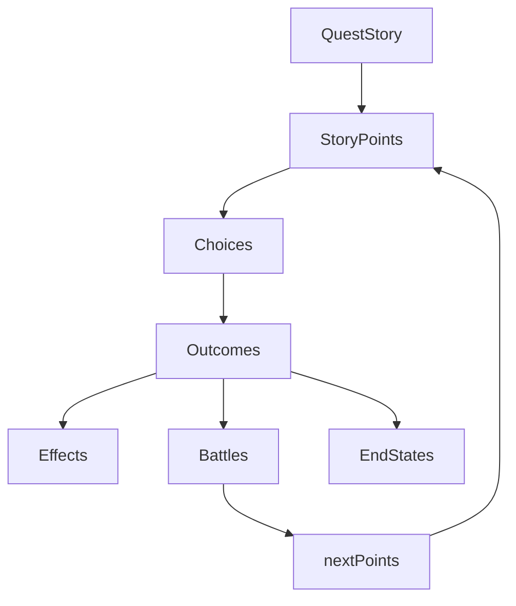

# Quest Authoring Guide

This document explains how to create a new quest in Isekai Quest, including quest structure, branching, battles, rewards, end states, and the asset pipeline.

---

## Quest System Overview



This diagram shows how the quest system processes player decisions.

- A **QuestStory** contains multiple **StoryPoints**
- Each StoryPoint presents **Choices**
- Choices produce **Outcomes**
- Outcomes may apply **Effects**, trigger **Battles**, or end the quest with an **EndState**
- Battles resolve and route the quest back into the story graph through **nextPoints**

---

## 1. Quest Overview

Quests are the primary narrative and gameplay structure within Isekai Quest. Each quest is composed of a series of interconnected story points that present narrative text, artwork, and player choices.

A quest progresses as the player moves from one StoryPoint to another by selecting choices. These choices may lead to additional narrative nodes, branching story paths, battles, rewards, or quest-ending outcomes.

At a high level, a quest follows this structure:

Quest
→ StoryPoints
→ Choices
→ Results
→ Branching Paths
→ End States

StoryPoints act as the core building blocks of a quest. Each StoryPoint represents a moment in the story where the player is presented with narrative context and a set of choices that determine how the quest progresses.

Through this system, quests can support:

- Linear progression
- Branching storylines
- Battle encounters
- Multiple endings
- Rewards and penalties based on player decisions

All quests ultimately resolve into one of two final states: **completed** or **failed**.

While quests may contain multiple branching paths, battles, and narrative outcomes, every possible path must eventually lead to one of these two final states. Authors can create many different reasons for reaching these outcomes, but the quest system requires that every branch terminate in either a completed or failed result.

Battle encounters, story outcomes, and branching decisions exist to shape the player's journey through the quest, but they do not represent final states themselves. Instead, they redirect the player to different StoryPoints that ultimately resolve the quest.

---

## 2. Quest File Structure

Each quest in Isekai Quest is defined as a single quest object that contains metadata about the quest and the collection of StoryPoints that define the narrative flow.

A quest file represents the complete structure of the quest, including its starting point, all possible story nodes, and the paths that connect them.

At a minimum, a quest contains the following core properties:

- **id** — a unique identifier for the quest
- **name** — the name displayed to the player
- **description** — a short explanation of the quest shown in the quest board
- **coverImageSrc** — a cover image for the quest
- **storyPoints** — the collection of StoryPoints that make up the quest

Quest progression begins at the quest's starting StoryPoint. In the current Version 1 implementation, the starting point is the first entry in the quest's `storyPoints` array.

From that point forward, the player progresses by selecting choices that route to other StoryPoints.

Each StoryPoint within the quest contains its own narrative content and references to other StoryPoints through `nextPointId` values. These references form the branching structure of the quest.

All StoryPoints referenced within a quest must exist within that quest's `storyPoints` collection.

### Storage and Registration

Quest files are stored within the project's quest content directory. Each quest is authored in its own file and exported as a quest object.

The Quest Board displays quests from a predefined quest list used by the application. To test or add a newly authored quest, the existing placeholder quest should be replaced with the new quest.

When adding a new quest:

- Create the quest file in the quest content directory.
- Export the quest object from the file.
- Replace the existing quest import in the quest list entry point with the newly created quest.
- Verify the new quest appears in the Quest Board UI.

### QuestStory Type Definition

```ts
export type QuestStory = {
  id: QuestStoryId;
  name: string;
  description: string;
  coverImageSrc: string;
  storyPoints: StoryPoint[];
  disabled?: boolean;
  completed?: boolean;
};
```

### Example Quest Object

Below is a simplified example showing the basic structure of a quest.

```ts
const exampleQuestStory = {
  id: "bandit_watch",
  disabled: false,
  completed: false,
  name: "Bandit Watch",
  description: "Investigate reports of suspicious riders near the trade road.",
  coverImageSrc: "/quests/bandit-watch/cover.webp",
  storyPoints: [
    {
      id: "SP1",
      imageSrc: "/quests/bandit-watch/sp1.webp",
      text: "You arrive at the edge of the trade road where merchants reported seeing armed riders watching caravans.",
      choices: [
        // StoryPointChoice examples are defined in Section 5
      ],
    },
  ],
};
```

---

## 3. StoryPoint Structure

StoryPoints are the core building blocks of every quest. Each StoryPoint represents a single moment in the story where the player is presented with narrative text, artwork, and a set of player choices.

When a quest begins, the system loads the first StoryPoint in the quest's `storyPoints` array. From there, the player progresses through the quest by selecting choices that route to other StoryPoints.

StoryPoints may optionally trigger additional gameplay systems such as battles.

---

### StoryPoint Type Definition

```ts
export type StoryPoint = {
  id: StoryPointId;
  imageSrc: string;
  text: string;
  battle?: BattleDetails;
  choices: StoryPointChoice[];
};
```

This type defines the structure that every StoryPoint must follow.

---

### Example StoryPoint Implementation

```ts
const storyPoint: StoryPoint = {
  id: "SP1",
  imageSrc: "/quests/bandit-watch/sp1.webp",
  text: "You reach the edge of the trade road where merchants reported suspicious riders watching caravans.",

  choices: [
    {
      text: "Observe the riders from a distance",
      nextPointId: "SP2",
    },
    {
      text: "Approach the riders directly",
      nextPointId: "SP3",
    },
  ],
};
```

The above example shows a StoryPoint presenting narrative context and two possible player actions that lead to different parts of the quest.

---

## 4. StoryPoint ID Conventions

StoryPoint IDs are how the quest system references and navigates between story nodes. Every choice in a StoryPoint routes the player to another StoryPoint by referencing its ID, so consistent naming is critical for authoring, debugging, and maintaining quests over time.

### Requirements

- Every StoryPoint ID must be **unique within the quest**.
- Any ID referenced by a choice or battle branch must match an existing StoryPoint ID in the same quest.
- IDs should remain stable once created. Renaming an ID requires updating every reference to it.
- Every quest must eventually resolve into **one completed ending** and **one failed ending**.

### Recommended Naming Pattern

Use a simple, readable convention that makes the structure of the quest easy to understand.

- **SP1, SP2, SP3** — linear progression nodes
- **SP3A, SP3B** — narrative branches that split from a shared moment
- **SP#F** — a narrative failure branch
- **SP#W** — a narrative completion branch

Example:

```txt
SP1
SP2
SP3
SP3A
SP3B
SP3F
SP4
SP5A
SP5B
SP5F
SP5W
SP6
```

In this example:

- `SP3A` and `SP3B` represent branching outcomes from StoryPoint 3.
- `SP3F` represents a failure branch resulting from StoryPoint 3.
- `SP5W` represents a completion branch resulting from StoryPoint 5.

Failure (`SP#F`) and completion (`SP#W`) nodes allow authors to present narrative outcomes before routing the player toward the final quest endings described later in this guide.

These nodes should ultimately funnel into the quest’s final ending nodes:

- the **final completed ending**
- the **final failed ending**

---

### Battle Outcome Naming Conventions

When a StoryPoint triggers a battle, the battle result may branch the story into separate StoryPoints based on the outcome.

Use the following battle outcome designators:

- **SP#W#** — win branch continuation nodes
- **SP#L#** — lose branch continuation nodes
- **SP#R#** — flee or retreat branch continuation nodes

The first number (`SP#`) represents the StoryPoint that triggered the battle.  
The second number (`#`) represents the sequence of nodes within that outcome branch.

Example:

```txt
SP4      (battle occurs here)
SP4W1    win branch node 1
SP4W2    win branch node 2
SP4L1    lose branch node 1
SP4R1    flee branch node 1
```

Battle branches may continue for multiple StoryPoints before reconnecting with the main storyline.

Example flow:

```txt
SP4
 ├─ win  → SP4W1 → SP4W2 → SP5
 ├─ lose → SP4L1 → SP4F
 └─ flee → SP4R1 → SP5
```

In this example, the win path continues for two StoryPoints before merging back into the main storyline at `SP5`.

---

### Final Ending Outcomes (Completed vs Failed)

All quest branches must ultimately resolve into one of two final outcomes:

- **completed**
- **failed**

These outcomes are defined by the `endState` property of a `StoryPointOutcome`.

A quest ends when the selected choice has:

- `nextPointId: null`
- `outcome.endState` set to either `'completed'` or `'failed'`

To keep quest endings consistent and easy to maintain, authors should funnel all narrative endings toward two final StoryPoints representing the quest’s final outcomes.

For example, if the quest contains ten main StoryPoints, the final endings might be structured as:

- **SP10A** — final completed ending
- **SP10B** — final failed ending

Narrative failure nodes earlier in the quest should route to the final failed ending.

Example:

```txt
SP3F  → SP10B
SP3W  → SP10A
SP4F  → SP10B
SP7F  → SP10B
SP7W  → SP10A

SP10A → completed ending
SP10B → failed ending
```

The final StoryPoints should present the concluding narrative and provide a terminal choice that ends the quest.

Example ending choice structure:

```ts
{
  label: "a",
  text: "Return to the guild with your report.",
  outcome: {
    endState: "completed"
  },
  nextPointId: null
}
```

Once a choice resolves with `nextPointId: null`, the quest flow terminates and no additional StoryPoints are loaded.

---

## 5. Choice Structure

Choices are how players interact with a StoryPoint and determine how the quest progresses. Each StoryPoint can present up to four possible choices to the player. These choices represent the actions the player can take at that moment in the story.

A choice can:

- route the player to another StoryPoint
- trigger a battle encounter
- apply effects such as rewards or penalties
- route the player to an outcome node that eventually leads to the final quest ending

Choices themselves normally **do not end the quest directly**. Instead, they route the player through narrative outcome nodes that eventually lead to the final completed or failed ending nodes described in Section 4.

Choices are represented by the `StoryPointChoice` type.

---

### StoryPointChoice Type Definition

```ts
export type StoryPointChoice = {
  label: "a" | "b" | "c" | "d";
  text: string;
  outcome?: StoryPointOutcome;
  nextPointId: StoryPointId | null;
};
```

Each property has a specific purpose:

- **label** — identifies the choice slot displayed in the UI
- **text** — the narrative description of the action the player can take
- **outcome** — optional gameplay effects triggered when the choice is selected
- **nextPointId** — the StoryPoint that loads after the choice is selected, or `null` if the quest ends

---

### StoryPointOutcome Type Definition

The `outcome` property defines additional gameplay effects triggered when a choice is selected.

```ts
export type StoryPointOutcome = {
  effect?: Effect;
  battle?: BattleDetails;
  endState?: "completed" | "failed";
};
```

An outcome may trigger:

- a **battle encounter**
- a **reward or penalty effect**
- the **final completed or failed state of the quest**

The `endState` property should only be used in **final quest-ending nodes** where the choice terminates the quest.

---

### Effect Type Definition

Effects apply changes to the player's character.

```ts
export type Effect = {
  hp?: number;
  mp?: number;
  coins?: Coins;
  items?: InventoryItemBase[];
};
```

Effects allow quests to reward or penalize the player through:

- health changes
- mana changes
- coin rewards
- item rewards

---

### Example Choice Implementation

```ts
choices: [
  {
    label: "a",
    text: "Observe the riders from the tree line.",
    nextPointId: "SP3",
  },
  {
    label: "b",
    text: "Step onto the road and confront them.",
    outcome: {
      battle: banditRiderBattle,
    },
    nextPointId: "SP4",
  },
  {
    label: "c",
    text: "Return to the guild and report what you saw.",
    nextPointId: "SP9A",
  },
];
```

In this example:

- Choice **A** continues the narrative.
- Choice **B** triggers a battle encounter before continuing the quest.
- Choice **C** routes to a narrative outcome StoryPoint that eventually funnels into the final completed ending.

---

### Example Final Ending Choice

The final StoryPoint of a quest contains a terminal choice that ends the quest.

```ts
choices: [
  {
    label: "a",
    text: "Turn in your report and accept your reward.",
    outcome: {
      endState: "completed",
    },
    nextPointId: null,
  },
];
```

Once a choice resolves with `nextPointId: null`, the quest flow terminates and no additional StoryPoints are loaded.

---

## 6. Branching and Story Progression

Quest progression occurs as the player moves from one StoryPoint to another through the choices available at each node. Each choice references a `nextPointId`, which determines the next StoryPoint that will be loaded.

This structure allows quests to support both **linear progression** and **branching narrative paths**.

A simple linear progression might look like:

```txt
SP1 → SP2 → SP3 → SP4 → SP5
```

Most quests introduce branching decisions that temporarily diverge from the main storyline before either reconnecting to the main path or funneling into one of the final quest endings.

---

### Narrative Branching

A StoryPoint may branch into multiple narrative outcomes.

```txt
SP1
 ↓
SP2
 ↓
SP3
 ├─ SP3A → SP4
 ├─ SP3B → SP4
 ├─ SP3F → SP10B
 └─ SP3W → SP10A
```

In this example:

- `SP3A` and `SP3B` represent alternate narrative paths that reconnect to the main storyline.
- `SP3F` represents a failure branch that funnels toward the final failed ending node `SP10B`.
- `SP3W` represents a successful outcome branch that funnels toward the final completed ending node `SP10A`.

Failure (`SP#F`) and completion (`SP#W`) branches allow authors to resolve quests early while still maintaining a consistent structure where all endings ultimately route to the final completed or failed nodes.

---

### Branch Reconnection

Branches do not always lead directly to quest endings. Often they reconnect with the main storyline after presenting alternate narrative paths.

Example:

```txt
SP4
 ├─ SP4A → SP5
 └─ SP4B → SP5
```

Here both branches eventually return to the same StoryPoint (`SP5`), allowing the narrative to diverge temporarily while still continuing along the main quest path.

---

### Battle Branching

Battles may introduce additional branching paths based on the battle outcome.

```txt
SP6 (battle)
 ├─ SP6W1 → SP6W2 → SP7
 ├─ SP6L1 → SP6F → SP10B
 └─ SP6R1 → SP7
```

In this structure:

- The **win path** continues the quest after additional narrative nodes.
- The **lose path** routes toward a failure branch.
- The **retreat path** reconnects with the main storyline.

Battle branches may continue independently for several StoryPoints before reconnecting to the main storyline or routing to a quest ending.

---

### Quest Resolution

Regardless of how many branches exist within a quest, all paths must eventually funnel toward the quest’s two final endings:

- the **completed ending**
- the **failed ending**

Example final resolution structure:

```txt
SP8 → SP9 → SP10A (completed)

SP3F → SP10B
SP6F → SP10B
SP7F → SP10B
```

These final nodes contain the terminal choices where `nextPointId` is `null` and the quest's `endState` is set to either `'completed'` or `'failed'`.

This structure allows authors to create rich branching narratives while still ensuring the quest resolves cleanly and predictably within the game system.

---

## 7. Outcome Nodes

Outcome nodes are StoryPoints that represent the consequences of a player's previous decision. These nodes are typically used to present narrative results, rewards, penalties, or other gameplay effects before the quest continues or ends.

Unlike standard StoryPoints that primarily offer branching choices, outcome nodes usually serve one of the following purposes:

- presenting the narrative result of a decision
- granting rewards or penalties
- transitioning the player toward a final quest ending
- continuing a branch of the storyline after a battle

Outcome nodes still use the same `StoryPoint` structure, but the choices within them often include an `outcome` property that applies gameplay effects.

---

### StoryPointOutcome Type Definition

The `StoryPointOutcome` type defines the effects that occur when a choice is selected.

```ts
export type StoryPointOutcome = {
  effect?: Effect;
  battle?: BattleDetails;
  endState?: "completed" | "failed";
};
```

An outcome can apply several types of changes:

- **effect** — modifies the player's state (HP, MP, coins, items)
- **battle** — triggers a combat encounter
- **endState** — marks the quest as completed or failed when the quest terminates

---

### Example Outcome Node

```ts
const outcomeNode: StoryPoint = {
  id: "SP7F",
  imageSrc: "/quests/bandit-watch/sp7-failed.webp",
  text: "The rider recognizes you from the roadside encounter. By the time you reach town the guards are already waiting.",

  choices: [
    {
      label: "a",
      text: "Submit to the guards.",
      nextPointId: "SP10B",
    },
  ],
};
```

In this example:

- The node represents a **failure outcome** from an earlier decision.
- The narrative explains the consequence of the player's actions.
- The node funnels the player toward the **final failed ending**.

---

### Example Reward Outcome

Outcome nodes may also grant rewards before continuing the story.

```ts
{
  label: "a",
  text: "Accept the guild's reward.",
  outcome: {
    effect: {
      coins: {
        gold: 0,
        silver: 5,
        copper: 0
      }
    }
  },
  nextPointId: "SP8"
}
```

In this example the player receives a coin reward before the quest continues.

---

### Terminal Outcome Example

When a quest reaches its final ending node, the outcome sets the quest’s final state.

```ts
{
  label: "a",
  text: "Return to the guild with your report.",
  outcome: {
    endState: "completed"
  },
  nextPointId: null
}
```

When `nextPointId` is `null`, the quest flow terminates and the quest's final state is applied.

---

## 8. Battle Nodes

Battle nodes are StoryPoints that initiate a combat encounter. Battles are triggered through the `battle` property of a `StoryPointOutcome` and allow quests to incorporate turn-based combat as part of the narrative.

When a battle is triggered, control temporarily shifts from the story system to the battle system. Once the battle resolves, the quest continues through the appropriate branch depending on the outcome of the encounter.

Battle encounters typically create three possible narrative paths:

- **Win** — the player defeats the opponent and the quest continues.
- **Lose** — the player is defeated and the quest may route toward a failure branch.
- **Retreat** — the player escapes and the quest reconnects to another point in the story.

These branches follow the naming conventions described earlier in Section 4.

---

### BattleDetails Type Definition

```ts
export type BattleDetails = {
  // battleIds should be set here in the details to link to BattleSlice state
  opponent: Opponent; // imported from BattleSlice
  backgroundImage?: string;
  escapeAllowed: boolean;
  escapePenalty?: Effect;
  reward?: Effect;
  nextPoints?: BattleNextPoints; // possible quest branch StoryPoints based on battle outcome
};
```

This structure defines the parameters of the battle:

- **opponent** — the enemy the player will fight
- **backgroundImage** — optional battlefield artwork
- **escapeAllowed** — determines if the player may flee the battle
- **escapePenalty** — optional penalty applied if the player retreats
- **reward** — optional reward granted when the player wins
- **nextPoints** — optional branching StoryPoints for battle outcomes

---

### Example Battle Choice Implementation

A battle is triggered by defining a `BattleDetails` object inside the choice outcome.

```ts
{
  label: "d",
  text: "Battle the air",
  nextPointId: "bw-p5",
  outcome: {
    battle: {
      opponent: goblin,
      escapeAllowed: false,
      reward: {
        hp: 10,
        mp: 10,
        coins: { gold: 5, silver: 10, copper: 0 }
      }
    }
  }
}
```

In this example:

- the choice triggers a battle through `outcome.battle`
- `escapeAllowed: false` prevents fleeing from combat
- the player receives HP, MP, and coins if they win the battle

---

### Battle Branching Example

After the battle resolves, the quest may branch to different StoryPoints depending on the result.

```txt
SP6 (battle)
 ├─ SP6W1 → SP6W2 → SP7
 ├─ SP6L1 → SP6F → SP10B
 └─ SP6R1 → SP7
```

In this structure:

- the **win path** continues the quest
- the **lose path** routes toward a failure branch
- the **retreat path** reconnects to the main storyline

Battle branches may continue for multiple StoryPoints before reconnecting to the main storyline or routing toward a quest ending.

---

### Battle Rewards and Penalties

Battle outcomes may apply rewards or penalties through the `reward` and `escapePenalty` properties.

Example reward:

```ts
reward: {
  coins: { gold: 1, silver: 5, copper: 0 }
}
```

Example retreat penalty:

```ts
escapePenalty: {
  hp: -10;
}
```

These effects are applied immediately after the battle resolves.

---

## 9. Opponent Definitions

Opponents are the enemy entities used by the battle system. Each battle references an opponent through `BattleDetails.opponent`. Authors can create custom opponents to match the narrative and difficulty of a quest encounter.

Opponents should be authored with both gameplay balance and narrative clarity in mind. The opponent’s name, stats, attacks, and artwork should communicate what kind of threat the player is facing.

---

### Opponent Type Definition

```ts
export interface Opponent {
  id: string;
  name: string;
  avatar: string;
  hp: number;
  mp: number;
  attacks: BattleOption[]; // Available attacks
}
```

---

### Example Opponent Implementation

```ts
const unknownRider: Opponent = {
  id: "unknown_rider",
  name: "Unknown Rider",
  avatar: "/opponents/unknown_rider.png",
  hp: 40,
  mp: 10,
  attacks: [
    // BattleOption entries (attacks) are defined elsewhere and referenced here
  ],
};
```

This example shows the minimum information required to create a battle-ready opponent. The `attacks` array should be populated using your existing `BattleOption` attack definitions.

---

### BattleNextPoints Type Definition

`BattleNextPoints` defines which StoryPoints the quest should route to after the battle resolves.

```ts
export type BattleNextPoints = {
  win: StoryPointId;
  lose: StoryPointId;
  flee: StoryPointId;
};
```

---

### Example Battle Outcome Routing (nextPoints)

Battle outcomes can route to different StoryPoints depending on whether the player wins, loses, or flees. In some quest moments, you may intentionally route all outcomes to the same StoryPoint to force a specific narrative result.

```ts
{
  id: "9A",
  imageSrc: "/quests/ambush_recon/ambush_sp9a.png",
  text: "The rider closes distance fast, convinced you are responsible. There is no time to negotiate.",
  choices: [
    {
      label: "a",
      text: "Fight the rider",
      nextPointId: "9F",
      outcome: {
        battle: {
          opponent: unknownRider,
          escapeAllowed: false,
          nextPoints: {
            win: "9F",
            lose: "9F",
            flee: "9F"
          }
        }
      }
    }
  ]
}
```

In this example:

- `escapeAllowed: false` prevents fleeing.
- `nextPoints` routes **win**, **lose**, and **flee** outcomes to the same StoryPoint (`9F`).
- This pattern is useful when the narrative outcome should occur regardless of battle result.

Authors can also create divergent battle branches by routing each outcome to a different StoryPoint:

- `win` → win branch node
- `lose` → failure branch node
- `flee` → retreat branch node or reconnection point

---

### Opponent Artwork Requirements

Opponent avatars must be consistent so they render correctly in the battle UI.

- **File type:** document the format used across your opponents (for example `png` or `webp`)
- **Dimensions:** document the pixel dimensions expected by the BattleScreen
- **Background:** document whether the avatar should be transparent or full background
- **Storage location:** document where opponent images are stored under `/public/opponent_avatars`

### Opponent Artwork Style Guide

Opponent avatars must follow a consistent visual style so they render correctly in the battle interface and match the overall tone of the game.

Opponent avatars should be illustrated as **full-body character portraits on a transparent background** so they can appear over the battle environment artwork.

**Artwork requirements**

- **Background:** transparent
- **File type:** PNG with transparency
- **Framing:** full body visible
- **Silhouette:** clear and readable at medium size
- **Environment:** none (the battle background is rendered separately)
- **Pose:** dynamic but readable combat stance
- **Lighting:** dramatic fantasy lighting with strong highlights and shadows

---

### Art Style Description

All opponent avatars should follow the same stylistic direction used by the current enemies in the game.

**Style characteristics**

- painterly fantasy illustration
- warm bronze or sepia color palette
- dramatic directional lighting
- slightly exaggerated fantasy proportions
- textured brushwork and soft shading
- dark fantasy tone

Characters should appear detailed and expressive while remaining visually readable against different battle backgrounds.

---

### Recommended Art Prompt Template

When generating new opponent artwork, use a consistent prompt structure to maintain visual cohesion across enemies.

Example prompt template:

```
A dark fantasy character portrait of a [CREATURE OR ENEMY TYPE],
illustrated in a painterly fantasy style with warm bronze lighting,
dramatic shadows, and textured brush strokes.
Full body character in a combat-ready stance, highly detailed armor or clothing,
slightly exaggerated fantasy proportions, strong silhouette,
isolated on a transparent background, no environment.
```

Replace `[CREATURE OR ENEMY TYPE]` with the desired opponent (goblin, bandit rider, assassin, mage, etc).

---

### Example Opponents

Current opponent avatars in the game follow this visual style:

- Goblin fighter with dagger
- Masked rider assassin on horseback

Future opponent artwork should maintain the same lighting, palette, and illustration style to ensure visual consistency across quests.

---

## 10. Inventory Rewards and Items

Inventory rewards are applied through the StoryPointOutcome.effect.items property.

Quests may grant items to the player as part of a reward or narrative outcome. Items are applied through the `effect.items` field inside a `StoryPointOutcome`.

Items granted through quests are added directly to the player's inventory and can later be used in battle, consumed, equipped, or sold depending on the item type.

Quest rewards should generally provide **positive effects or bonuses**, since they represent rewards for completing narrative events.

---

### EffectfulItem Type Definition

Some inventory items contain gameplay effects or usage costs. These are defined through the `EffectfulItem` interface.

```ts
export interface EffectfulItem {
  effect: {
    hp?: number;
    mp?: number;
  };
  cost?: {
    hp?: number;
    mp?: number;
  };
}
```

The `effect` property defines the benefit granted when the item is used.

The `cost` property defines a cost required to activate the item or ability. Costs are typically used when purchasing items in shops or activating special item abilities.

Quest rewards should typically **not include costs**, since they represent earned bonuses.

---

### InventoryItemBase Type Definition

All items stored in the player's inventory follow the `InventoryItemBase` structure.

```ts
export interface InventoryItemBase extends EffectfulItem {
  id: string;
  icon: string;
  title: string;
  type: InventoryItemType;
  description: string;
  price?: Coins;
  instanceId?: number; // unique identifier for individual instances of items
}
```

Key fields:

- **id** — unique identifier for the item type
- **icon** — image used to represent the item in the UI
- **title** — display name of the item
- **type** — category of the item
- **description** — text explaining what the item does
- **price** — optional market value for shops
- **instanceId** — unique identifier when multiple copies of an item exist

---

### Example Item Definition

```ts
const mysteriousRing: InventoryItemBase = {
  id: "mysterious_ring",
  icon: "/items/mysterious_ring.png",
  title: "Mysterious Ring",
  type: "quest",
  description:
    "A strange ring taken from the fallen rider. Wearing it seems to strengthen your vitality.",
  effect: {
    hp: 15,
  },
  price: { gold: 1, silver: 0, copper: 0 },
};
```

In this example:

- the ring grants a **positive HP bonus**
- the item has **no usage cost**
- the item may still have a **shop value** through the `price` field

---

### Granting an Item Through a Quest

Items are granted through the `items` array inside a `StoryPointOutcome`.

```ts
{
  label: "b",
  text: "Search the fallen rider.",
  outcome: {
    effect: {
      items: [
        mysteriousRing
      ]
    }
  },
  nextPointId: "SP7"
}
```

In this example:

- the player searches the defeated enemy
- the quest grants a new inventory item
- the item is added to the player's inventory before the story continues

---

### Multiple Item Rewards

Quests may grant multiple items at once.

```ts
effect: {
  items: [healingPotion, banditDagger];
}
```

This allows quests to reward the player with equipment, consumables, or special quest items.

---

### Authoring Guidelines

When granting items through quests, authors should consider:

- whether the item is a **permanent reward** or a **story item**
- the **power level** of the reward relative to the quest difficulty
- whether the reward is **unique** or may appear again in future quests
- whether the reward logically fits the narrative moment where it is obtained

Quest rewards should typically provide **positive effects**, since they represent successful progress or discovery within the story.

---

## 11. Choice Rules and Limits

Each `StoryPoint` presents the player with a set of choices that determine how the quest progresses. Choices allow the player to influence the narrative path, trigger battles, receive rewards, or move to another StoryPoint.

Choices are defined using the `StoryPointChoice` type.

---

### StoryPointChoice Type Definition

```ts
export type StoryPointChoice = {
  label: "a" | "b" | "c" | "d";
  text: string;
  outcome?: StoryPointOutcome;
  nextPointId: StoryPointId | null;
};
```

---

### Maximum Number of Choices

A StoryPoint may contain **a maximum of four choices**.

These choices must use the following labels:

- `a`
- `b`
- `c`
- `d`

Authors may include fewer than four choices if appropriate for the narrative, but they may **not exceed four**.

This limit ensures the user interface remains readable and prevents overly complex branching structures.

---

### Example StoryPoint with Choices

```ts
{
  id: "SP3",
  imageSrc: "/quests/bandit-watch/sp3.webp",
  text: "You spot a rider watching the trade road from a distance.",

  choices: [
    {
      label: "a",
      text: "Observe quietly from the trees.",
      nextPointId: "SP4"
    },
    {
      label: "b",
      text: "Approach the rider directly.",
      nextPointId: "SP5"
    },
    {
      label: "c",
      text: "Return to town and report the sighting.",
      nextPointId: "SP3W"
    }
  ]
}
```

In this example:

- The StoryPoint presents three possible player decisions.
- Each choice routes to another StoryPoint.
- The labels follow the required `a–d` format.

Quest endings should be handled through **dedicated ending nodes**, as described in earlier sections of this guide.

---

## 12. Quest Images and Art Assets

Each StoryPoint in a quest includes an image that visually represents the current scene. These images are stored within the project’s `/public` directory and referenced through the `imageSrc` field of the `StoryPoint`.

Quest images help reinforce the narrative and provide visual context for the player as they progress through the story.

---

### Image Storage Location

Quest images are stored inside the `/public/quests` directory.

Each quest has its own subdirectory:

```
/public/quests/{quest_id}/
```

Example structure:

```
public/
  quests/
    ambush_recon/
      ambush_cover.png
      ambush_sp1.png
      ambush_sp2.png
      ambush_sp3a.png
      ambush_sp3b.png
      ambush_sp3f.png
```

Each quest folder should contain:

- one **cover image**
- one image for **each StoryPoint**

---

### Image Naming Convention

Quest images should be named according to their corresponding StoryPoint ID.

General format:

```
{quest_prefix}_sp{story_point_id}.png
```

Examples:

```
ambush_sp1.png
ambush_sp3a.png
ambush_sp5b.png
ambush_sp8f.png
ambush_sp10a.png
ambush_sp10b.png
```

Cover images should follow this format:

```
{quest_prefix}_cover.png
```

Example:

```
ambush_cover.png
```

This naming system keeps the image files easy to locate and directly associated with the StoryPoints they represent.

---

### Image Orientation and Framing

Quest scene images should use a **horizontal cinematic orientation**.

The scene should fill the frame with a clear focal point representing the narrative moment described in the StoryPoint.

Common visual elements include:

- environmental storytelling
- characters interacting
- objects or locations relevant to the story
- lighting that emphasizes mood and atmosphere

Images should feel like a **snapshot of the story moment** the player is currently experiencing.

Future quests should match the orientation used by existing quest scenes.

---

### File Format

Quest images should use the following format:

```
PNG
```

PNG ensures consistent rendering quality and compatibility across browsers.

---

### Referencing Images in a StoryPoint

Each StoryPoint references its corresponding image using the `imageSrc` field.

Example:

```ts
{
  id: "SP1",
  imageSrc: "/quests/ambush_recon/ambush_sp1.png",
  text: "You arrive at the edge of the trade road where merchants reported suspicious riders.",
  choices: [...]
}
```

The `imageSrc` path must match the file location inside the `/public` directory.

---

## 13. Quest Artwork Style Prompt

To maintain visual consistency across the game, all quest scene artwork should be generated using the same base prompt structure. This ensures that different quests still appear as part of the same world.

Quest scene images should follow the established **dark fantasy painterly style** used throughout the project.

---

### Base Artwork Prompt

Use the following base prompt when generating quest scene artwork:

```
A dark fantasy scene illustrated in a painterly fantasy style with expressive brush strokes, warm bronze and amber lighting, dramatic shadows, rich textures, and cinematic composition. The environment should feel immersive and atmospheric, with detailed props and environmental storytelling. Horizontal cinematic framing, high detail, fantasy RPG concept art quality.
```

---

### Scene Description

After the base prompt, add a description of the specific story moment being depicted.

Example:

```
A dark fantasy scene illustrated in a painterly fantasy style with expressive brush strokes, warm bronze and amber lighting, dramatic shadows, rich textures, and cinematic composition. The environment should feel immersive and atmospheric, with detailed props and environmental storytelling. Horizontal cinematic framing, high detail, fantasy RPG concept art quality.

A weathered parchment map spread across a wooden table showing a forest road labeled "Ambush Alley", candles burning nearby, a compass and quill resting on the map while investigation notes are written in a journal.
```

---

### Composition Guidelines

Quest scene artwork should follow these general rules:

- **Horizontal cinematic orientation**
- **Strong focal point that reflects the story moment**
- **Environmental storytelling elements**
- **Dramatic fantasy lighting**
- **No UI elements or text overlays**
- **Consistent painterly fantasy art style**

---

### Narrative Alignment

Each image should clearly represent the narrative moment described in the StoryPoint text.

The goal of quest artwork is to visually reinforce the story and help the player understand the environment, characters, or situation being presented.

---

## 14. Story Design Guidelines

While the previous sections explain the technical structure of quests, this section provides guidance on how to design engaging and well-structured quest stories.

A good quest should feel intentional, readable, and rewarding for the player.

---

### Recommended Quest Design Flow

When designing a quest, it is often easiest to work backward from the final outcome and then build the story structure around it.

```
Ending
  ↓
Beginning
  ↓
Critical Path
  ↓
Branching Paths
```

This approach helps ensure that the quest has a clear objective and logical structure before adding complexity.

---

### 1. Start With the Ending

Before writing the quest, decide what **successful completion** looks like.

Ask yourself:

- What is the player's goal?
- What action marks the quest as completed?
- What reward or narrative resolution should the player receive?

Once the completion outcome is clear, also determine what **failure** looks like.

Failure outcomes might include:

- being defeated in battle
- making the wrong decision
- abandoning the objective
- being discovered or accused

Defining both **success and failure** first helps ensure the quest has a clear purpose.

---

### 2. Define the Quest Beginning

Next, determine how the quest begins once the player accepts it at the Guild Hall.

The first StoryPoint should establish:

- the quest objective
- the location or situation
- the initial direction the player should investigate

This opening moment sets the tone for the entire quest.

---

### 3. Build the Critical Path

After defining the start and end, create a **linear path of StoryPoints** that leads directly from the beginning of the quest to successful completion.

This path represents the **core sequence of events** required to solve the quest.

Think of this as the quest's **critical path**, where each step logically progresses toward the objective.

Example flow:

```
Start → Investigation → Discovery → Confrontation → Completion
```

Once this clear success path exists, the quest will always have a reliable structure.

---

### 4. Add Branching Paths

After the critical path is complete, begin adding branches that make the quest more dynamic.

Branches may include:

- alternate investigation routes
- battle encounters
- optional discoveries
- hidden rewards
- narrative consequences
- failure branches

Some branches may reconnect to the main path, while others may lead to failure or alternate endings.

Branches should enhance the story without making the quest confusing to follow.

---

### 5. Keep the Story Readable

Even with multiple branches, players should always understand what is happening.

To maintain clarity:

- keep StoryPoint text concise
- ensure each choice clearly communicates the player's action
- avoid excessive branching that becomes difficult to follow
- ensure failure branches still provide satisfying narrative conclusions

The goal is to create a quest that feels **interactive and meaningful**, while still remaining easy to navigate.

---

### Design Summary

A strong quest structure follows this general process:

```
1. Define the ending
2. Define the beginning
3. Build a clear path to success
4. Add branching outcomes
5. Ensure the story remains readable
```

By starting with a clear objective and layering in choices afterward, authors can create quests that feel structured, engaging, and rewarding.

---

## 15. Testing a Quest

After authoring a quest, it should be tested locally to ensure that all StoryPoints connect correctly and the quest resolves as expected.

Testing verifies that the quest structure is valid and that players will not encounter broken branches or unreachable endings.

---

### 1. Add the Quest to the Quest Board

To test a quest, temporarily replace an existing quest in the quest board configuration with the new quest.

This allows the quest to appear in the Guild Hall so it can be accepted and played through.

Example:

```ts
import { myNewQuest } from "@/data/quests/my_new_quest";
```

Replace one of the existing quest entries with your new quest.

After saving, reload the application and confirm the quest appears in the Guild Hall.

---

### 2. Play Through Multiple Paths

Accept the quest and play through it several times using different choices.

You should verify that:

- the story progresses correctly between StoryPoints
- battles trigger correctly
- item rewards are granted when expected
- failure branches route to the correct failure ending
- completion branches route to the correct completion ending

---

### 3. Verify StoryPoint Connections

Ensure that every `nextPointId` references a valid StoryPoint within the quest.

Common issues to check for:

- incorrect StoryPoint IDs
- misspelled StoryPoint references
- branches pointing to non-existent StoryPoints

Broken connections can cause the quest flow to stop unexpectedly.

---

### 4. Confirm Quest End States

Every quest must end in one of two states:

```
completed
failed
```

All branches should eventually route to a final StoryPoint that sets one of these end states.

Example ending:

```ts
{
  label: "a",
  text: "Return to the guild with your report.",
  outcome: {
    endState: "completed"
  },
  nextPointId: null
}
```

---

### 5. Verify Images and Assets

Confirm that all quest images load correctly.

Check that:

- each StoryPoint image exists in `/public/quests/{quest_id}`
- image filenames match the `imageSrc` paths
- the quest cover image loads correctly in the Guild Hall

Missing or incorrect image paths will cause scenes to display incorrectly.

---

### 6. Optional: Use an AI Agent to Generate Test Sequences

For quests with multiple branches, manually determining every possible path can be difficult.

A reliable approach is to paste the quest’s `QuestStory` source code into an AI agent and request a full list of **test sequences** that cover every branch.

This helps ensure that every node and outcome is tested systematically.

The generated test paths should include:

- **failure nodes** (`SP#F` branches)
- **completion nodes** (`SP#W` branches)
- **item reward nodes**
- **battle nodes**
- **battle outcome branches** (win, lose, flee)

This prevents guesswork and ensures that every part of the quest structure behaves correctly.

Saving the generated test paths can also help reviewers reproduce your testing process when reviewing the quest.

---

### Testing Checklist

Before committing a quest, confirm the following:

```
□ Quest appears in the Guild Hall
□ All StoryPoints are reachable
□ No broken nextPointId references
□ Battles trigger correctly
□ Rewards and items are granted correctly
□ Failure branches route to the failed ending
□ Completion branches route to the completed ending
□ All quest images load correctly
□ No StoryPoint contains more than four choices
```

Completing this checklist ensures the quest is stable and ready to be included in the game.
