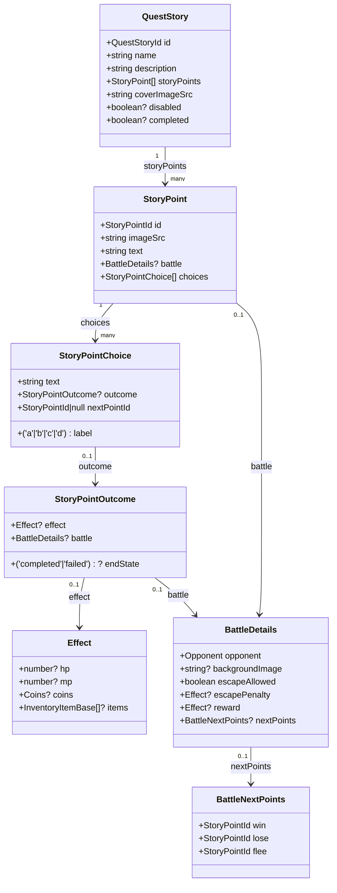
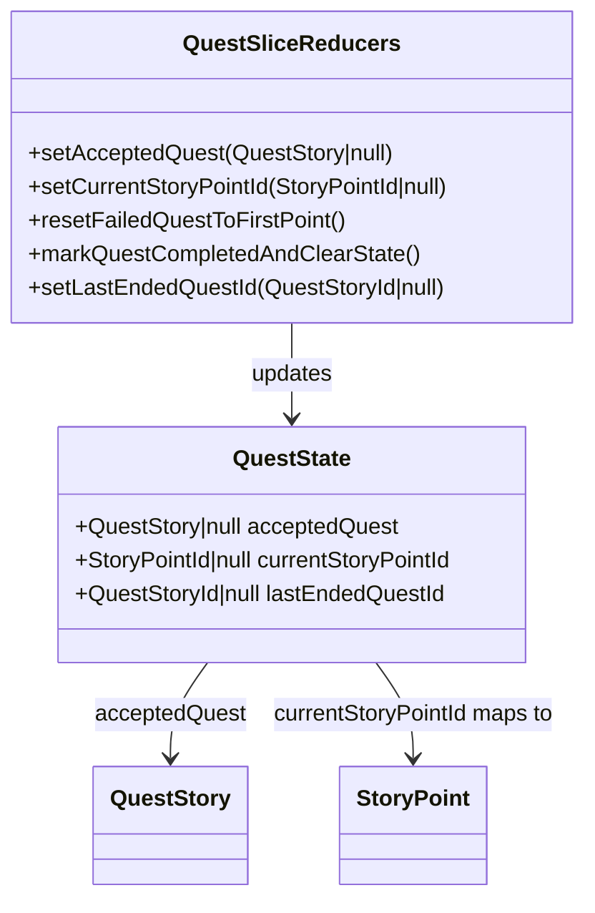

# Quest Data Model — Isekai Quest Architecture

This document explains the **data structures that power quests in Isekai Quest**.  
While the _User Interaction Flow_ documentation shows how a **player moves through the UI**, this document focuses on **how quests are structured in code**.

The quest system is built as a **node-based narrative graph** composed of story points, choices, and optional battle or outcome logic.

---

# Core Quest Data Model

The following diagram illustrates the **relationships between the primary quest data structures**.



---

# Quest State Management (Redux)

Quest progression is tracked in **QuestSlice**, which maintains the player's active quest and current position within the quest graph.



---

# Quest Structure Overview

A quest is composed of **story nodes connected through player choices**.

Typical progression:

```
QuestStory
   ↓
StoryPoint
   ↓
Player Choice
   ↓
(Optional) Outcome or Battle
   ↓
Next StoryPoint
   ↓
EndState (completed or failed)
```

Each **StoryPoint** acts as a node in a directed graph.

Each **Choice** represents a branch to another node.

StoryPoints may optionally contain:

- a **battle encounter**
- a **choice outcome**
- a **quest ending**

This structure allows quests to support **branching narrative paths** while still being easy to author as structured data.

---

# Choice Outcome

Some player decisions produce **results before continuing the quest**.

These results are modeled through:

```
StoryPointChoice.outcome
```

A **Choice Outcome** allows a quest to apply gameplay effects or trigger additional events before the story continues.

Possible outcome behaviors include:

• granting items or coins  
• modifying player HP or MP  
• triggering a battle encounter  
• ending the quest with a success or failure state

Example structure:

```
StoryPointChoice
 ├─ nextPointId
 └─ outcome
      ├─ effect
      ├─ battle
      └─ endState
```

This allows quests to support **custom narrative consequences** while still following a consistent structure.

---

# Battle Branching

Battles may occur in two locations within a quest:

1. Directly inside a **StoryPoint**
2. Inside a **Choice Outcome**

When a battle occurs, the quest may branch depending on the result of the encounter.

Battle outcomes are defined through the `BattleNextPoints` structure.

```
BattleDetails
 └─ nextPoints
      ├─ win
      ├─ lose
      └─ flee
```

Each result maps to a **StoryPointId**, allowing the quest to branch to different narrative outcomes depending on how the battle resolves.

Example branching logic:

• winning the battle may allow the player to continue the quest  
• losing the battle may redirect to a failure path  
• fleeing may lead to a different narrative consequence

If `nextPoints` is defined, the battle system uses it to determine the next **StoryPoint** after combat resolution.

---

# Resolution Rules

When a player selects a choice, the quest system determines the next step using the following evaluation order.

## 1. Quest Ending

If the choice outcome contains an **endState**, the quest ends immediately.

```
outcome.endState = "completed" | "failed"
```

The quest system records the result and clears the active quest state.

---

## 2. Battle Resolution

If the outcome triggers a battle:

```
outcome.battle
```

The battle system resolves the encounter and determines the next story point using:

```
battle.nextPoints
```

The battle result maps to a new `StoryPointId` based on:

• win  
• lose  
• flee

---

## 3. Standard Navigation

If no outcome logic overrides navigation, the quest continues using:

```
choice.nextPointId
```

The system loads the story point that matches the referenced `StoryPointId`.

---

## Resolution Priority

In summary, the quest engine evaluates navigation in this order:

1. **endState**
2. **battle.nextPoints**
3. **choice.nextPointId**

This ensures that quest progression remains predictable and consistent for both developers and quest authors.

---

# Summary

The quest system in Isekai Quest is designed as a **flexible narrative graph**.

Each quest is composed of **StoryPoints** that act as nodes in a branching structure.  
Players navigate through the quest by selecting **Choices**, which determine how the story progresses.

Key architectural concepts:

• **StoryPoints** represent narrative moments within a quest  
• **Choices** create branching paths between story points  
• **Choice Outcomes** allow custom gameplay results such as rewards, penalties, or battle encounters  
• **Battles** introduce conditional branching based on combat results  
• **Quest state** is managed centrally in Redux through `QuestSlice`

This architecture allows quests to support **complex branching narratives** while remaining structured and easy for developers to author as data.

Because quests are represented as structured objects rather than procedural scripts, new quests can be created simply by defining new **QuestStory** data without modifying core game logic.
