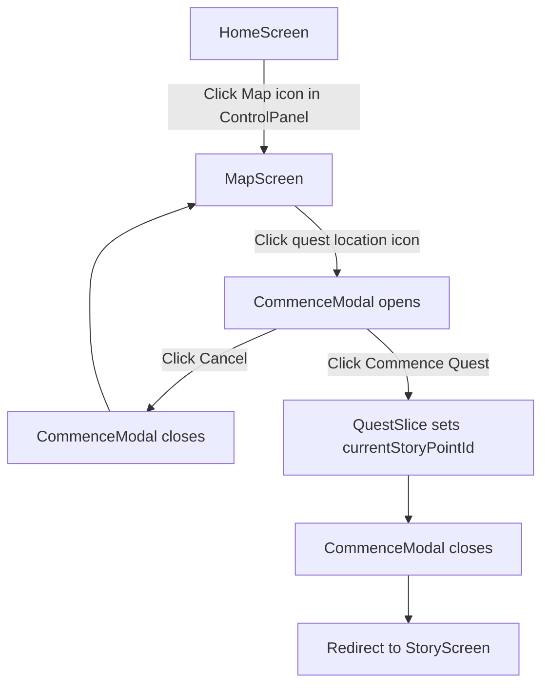

# Commence Quest Flow

This flow describes how a player begins an accepted quest from the world map.

The process begins when the player navigates to the MapScreen from the HomeScreen using the ControlPanel. The player selects the quest location on the map which opens the CommenceModal. This modal allows the player to confirm or cancel the quest start.

If the player confirms the action, the QuestSlice initializes the quest progression by setting the `currentStoryPointId`. The modal closes and the player is redirected to the StoryScreen where the quest narrative begins.

This flow interacts with the QuestSlice in Redux.

---

## Interaction Flow

| Component   | User Action                    | Leads To                            |
| ----------- | ------------------------------ | ----------------------------------- |
| HomeScreen  | User clicks **Commence Quest** | QuestSlice retrieves accepted quest |
| QuestSlice  | Quest retrieved                | Quest data prepared for story       |
| StoryScreen | StoryScreen loads              | First StoryPoint displayed          |
| StoryScreen | Narrative displayed            | Player reads story                  |
| StoryScreen | Player selects choice          | Quest progression logic triggered   |

---

## Flow Diagram

---

## Key Components

- HomeScreen
- MapScreen
- CommenceModal
- StoryScreen

---

## State Updates

QuestSlice

- `currentStoryPointId` is set to the first story point of the accepted quest
- Quest progression begins when the StoryScreen loads
